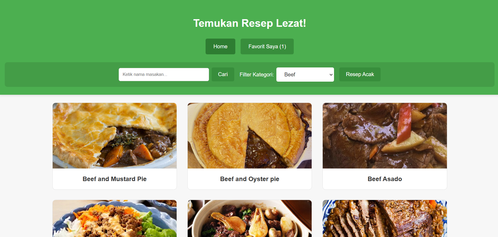

# RecipeApp - Aplikasi Pencari Resep Full-Stack

)

**RecipeApp** adalah aplikasi web modern (*Single Page Application*) yang memungkinkan pengguna untuk mencari, melihat, dan menyimpan resep masakan dari seluruh dunia. Proyek ini dibangun dengan arsitektur *full-stack* yang memisahkan antara frontend dan backend, serta dijalankan dalam lingkungan yang konsisten menggunakan Docker.

---

## Fitur Utama

-   **Pencarian Resep:** Cari resep berdasarkan nama masakan.
-   **Filter Kategori:** Tampilkan resep dari kategori tertentu (misal: "Seafood", "Dessert").
-   **Resep Acak:** Dapatkan inspirasi resep kejutan dengan satu kali klik.
-   **Detail Resep Komprehensif:** Lihat informasi lengkap, termasuk bahan, instruksi langkah demi langkah, dan video tutorial dari YouTube.
-   **Manajemen Favorit:** Simpan resep yang Anda sukai untuk diakses kembali dengan mudah (menggunakan `localStorage` di browser).

---

## Teknologi yang Digunakan

Proyek ini dibagi menjadi dua layanan utama yang dijalankan oleh Docker Compose.

#### **Frontend (Aplikasi Klien)**
-   **Vue.js (v3):** Framework JavaScript untuk membangun antarmuka pengguna yang interaktif.
-   **Vite:** *Build tool* modern untuk pengembangan frontend yang super cepat.
-   **Vue Router:** Untuk navigasi sisi klien dalam SPA.
-   **Pinia:** Untuk manajemen *state* terpusat.
-   **Tailwind CSS:** Untuk styling antarmuka.

#### **Backend (API Server)**
-   **PHP (v8.2):** Bahasa pemrograman di sisi server.
-   **Slim Framework (v4):** *Micro-framework* PHP yang ringan dan cepat, digunakan untuk membangun API.
-   **Apache:** *Web server* yang berjalan di dalam kontainer untuk melayani aplikasi Slim.
-   **Composer:** Manajer dependensi untuk pustaka PHP.

#### **Lingkungan & Orkestrasi**
-   **Docker:** Platform untuk kontainerisasi aplikasi.
-   **Docker Compose:** Alat untuk mendefinisikan dan menjalankan aplikasi multi-kontainer.

---

## Struktur Proyek

Struktur folder utama proyek diatur sebagai berikut untuk memisahkan tanggung jawab:

```
/
├── backend/                # Kode untuk backend (Slim Framework)
│   ├── public/             # Root direktori untuk web server
│   │   ├── .htaccess
│   │   └── index.php
│   ├── composer.json
│   └── Dockerfile
│
├── frontend/               # Kode untuk frontend (Vue.js)
│   ├── src/
│   ├── vite.config.js
│   ├── package.json
│   └── ...
│
└── docker-compose.yml      # File utama untuk menjalankan seluruh aplikasi
```

---

## Instalasi dan Menjalankan Proyek

Untuk menjalankan proyek ini di lingkungan lokal Anda, Anda hanya memerlukan **Git** dan **Docker**.

### Prasyarat
-   [Git](https://git-scm.com/downloads)
-   [Docker & Docker Compose](https://www.docker.com/products/docker-desktop/) (Docker Desktop untuk Windows/Mac sudah termasuk Docker Compose).

### Langkah-langkah Instalasi

1.  **Clone Repositori**
    Buka terminal atau command prompt Anda dan jalankan perintah berikut:
    ```bash
    git clone [https://github.com/](https://github.com/)[NAMA_PENGGUNA_ANDA]/[NAMA_REPOSITORI_ANDA].git
    cd [NAMA_REPOSITORI_ANDA]
    ```

2.  **Bangun dan Jalankan Kontainer Docker**
    Pastikan Docker Desktop sudah berjalan di komputer Anda. Kemudian, jalankan perintah berikut dari direktori root proyek:
    ```bash
    docker-compose up --build
    ```
    -   Perintah ini akan membaca file `docker-compose.yml`.
    -   `--build` akan memaksa Docker untuk membangun *image* baru untuk `frontend` dan `backend` berdasarkan `Dockerfile` masing-masing. Ini juga akan menjalankan `npm install` dan `composer install` secara otomatis.
    -   Setelah selesai, kedua kontainer (frontend dan backend) akan berjalan.

3.  **Akses Aplikasi**
    Buka browser favorit Anda dan kunjungi:
    [**http://localhost:5173**](http://localhost:5173)

    Aplikasi resep Anda sekarang seharusnya sudah berjalan dengan lancar!

### Menghentikan Aplikasi

Untuk menghentikan semua kontainer yang berjalan, kembali ke terminal Anda (di mana `docker-compose up` sedang berjalan) dan tekan `Ctrl + C`. Atau, dari terminal lain di direktori yang sama, jalankan:
```bash
docker-compose down
```

---

## Endpoint API

Backend Slim Framework bertindak sebagai *proxy* ke [TheMealDB API](https://www.themealdb.com/api.php). Semua permintaan dari frontend diarahkan ke backend terlebih dahulu untuk menyembunyikan detail API eksternal.

-   **Format URL:** `http://localhost:5173/api/proxy/{endpoint_themealdb}`
-   **Contoh:**
    -   Untuk mencari resep ayam, frontend akan memanggil:
        `/api/proxy/search.php?s=chicken`
    -   Untuk mendapatkan detail resep dengan ID 52772, frontend akan memanggil:
        `/api/proxy/lookup.php?i=52772`

---
## Lisensi

Proyek ini dilisensikan di bawah Lisensi MIT.
                